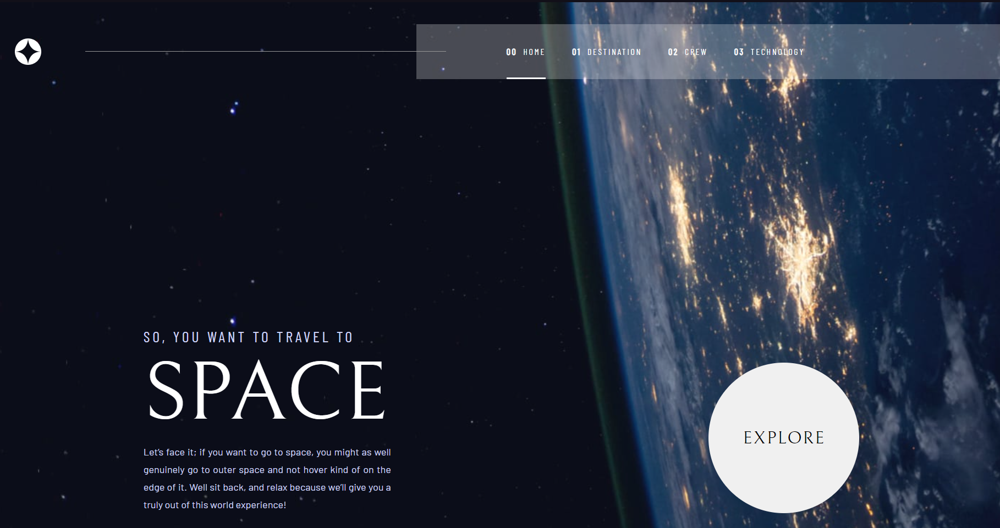
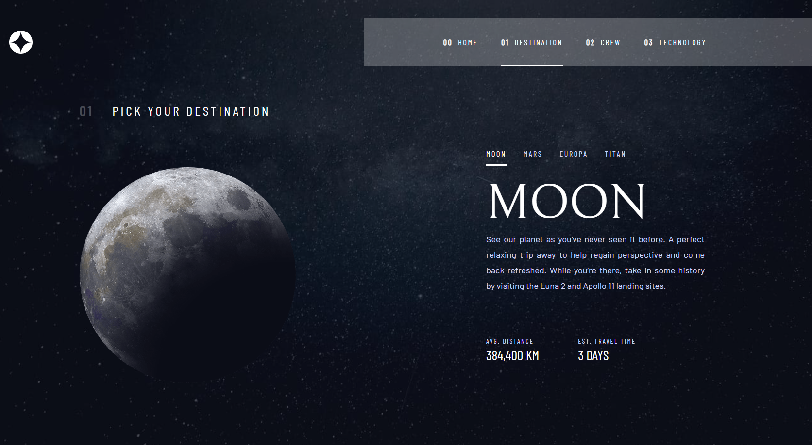
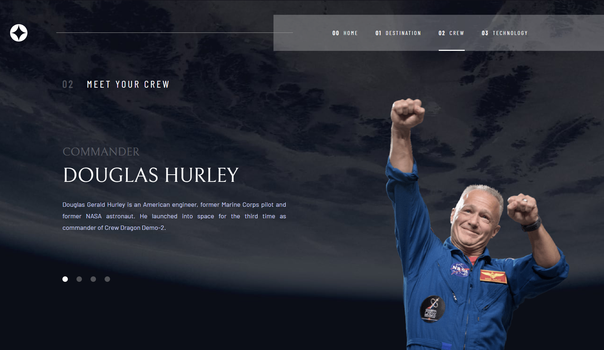
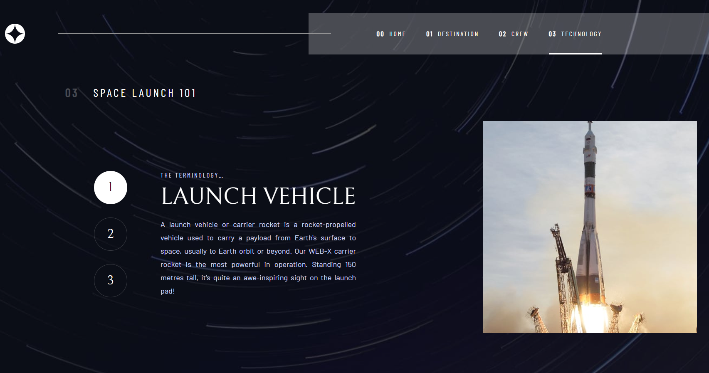
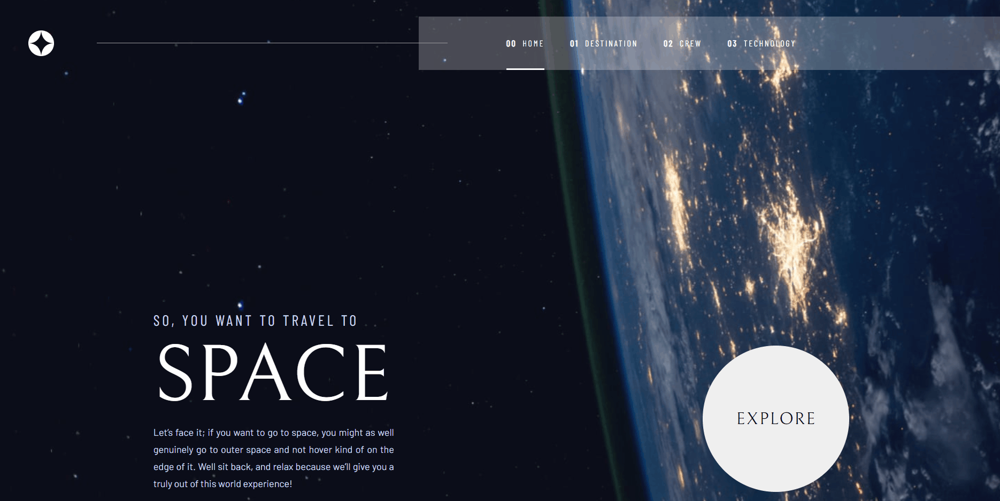

# Frontend Mentor - Space tourism website solution

This is a solution to the [Space tourism website challenge on Frontend Mentor](https://www.frontendmentor.io/challenges/space-tourism-multipage-website-gRWj1URZ3). Frontend Mentor challenges help you improve your coding skills by building realistic projects. 

## Table of contents

- [Overview](#overview)
  - [The challenge](#the-challenge)
  - [Screenshot](#screenshot)
  - [Links](#links)
- [My process](#my-process)
  - [Built with](#built-with)
  - [What I learned](#what-i-learned)
  - [Continued development](#continued-development)
  - [Useful resources](#useful-resources)
- [About the Author](#author)
- [Acknowledgments](#acknowledgments)"

## Overview

### The challenge

Users should be able to:

- View the optimal layout for each of the website's pages depending on their device's screen size
- See hover states for all interactive elements on the page
- View each page and be able to toggle between the tabs to see new information

### Screenshot

- Project Overview

- Active States and Notification Counter

### Links

- Solution URL: [https://github.com/matheus-alopes/space-tourism-multiple-website.git](https://github.com/matheus-alopes/space-tourism-multiple-website.git)
- Live Site URL: [https://matheus-alopes.github.io/space-tourism-multiple-website/](https://matheus-alopes.github.io/space-tourism-multiple-website/)

## My process

### Built with

- Semantic HTML5 markup
- CSS custom properties
- Flexbox
- Grid
- Javascript
- DOM manipulation

### What I learned

Through this project I could practice a lot of element positioning with CSS and important JS concepts on frontend programming, as DOM elements manipulation.

### Continued development

Talking about the future, my plans for continued development are all around an solid formation at the main frontend development skill set. This implies on making more projects like this one, to put in practice all relevant knowledge about HTML, CSS and Javascript; learn about React etc.

### Useful resources

- [My Frontend Summary](https://just-patch-a6b.notion.site/Resumo-De-Aulas-do-DevQuest-4092469f5cb04a3a913b87cd3d7601b4) - Those are the notes (they are in Portuguese) I made about the classes I watched on the "Dev em Dobro" online training, for Front End dev formation

## About the Author

I'm just a guy trying hard to learn how to programm and make this a carreer.
- GitHub - [matheus-alopes](https://github.com/matheus-alopes)
- Discord - [@Malopes#5389](https://discord.com/channels/@Malopes#5389)
- Frontend Mentor - [@matheus-alopes](https://www.frontendmentor.io/profile/matheus-alopes)

## Acknowledgments

Thanks for all the "Dev Quest" teachers and staff, for your great support and tireless atttention.
